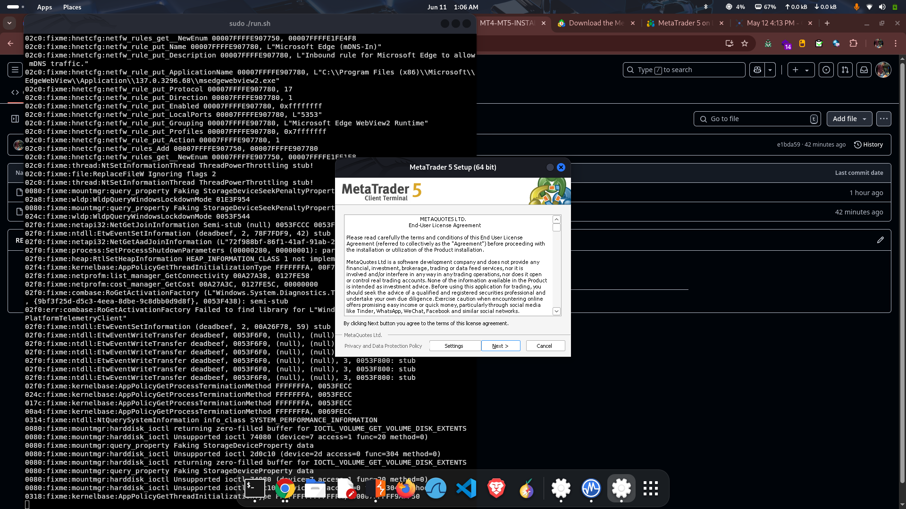
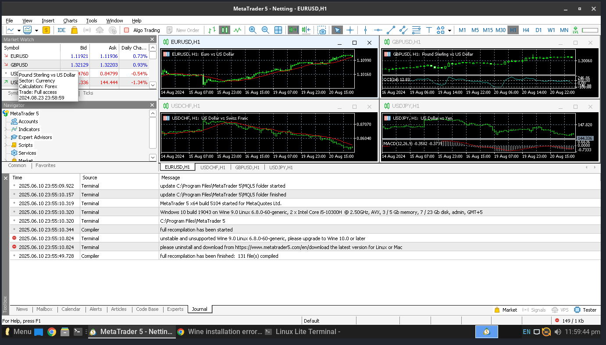

<h1 align="center">🚀 MT4 / MT5 Installation Automation for Linux</h1>

<p align="center">
  
  
  
</p>

---

## 📌 Overview

This project offers a **fully automated script** to install **MetaTrader 4 (MT4)** or **MetaTrader 5 (MT5)** on **Linux** using **Wine**.  
Perfect for traders and developers who want to run MT4/MT5 natively on **Linux Lite**, **Ubuntu**, or any **Debian-based** distribution without the hassle of manual configuration.

---

## 📸 Installation Preview

<p align="center">
  
  <br/>
  <em>🔧 Automated script updating and configuring Wine</em>
</p>

<p align="center">
  
  <br/>
  <em>📥 MetaTrader installer running via Wine</em>
</p>

---

## ⚙️ Features

- ✅ Automatically installs Wine (32-bit + 64-bit)
- ✅ Adds required dependencies: `winetricks`, `cabextract`, `wget`
- ✅ Downloads and runs the MT5 installer (official)
- ✅ Simple and user-friendly CLI automation
- ✅ Lightweight, portable, and open-source

---

## 🧰 Prerequisites

- Debian-based distro: **Linux Lite**, **Ubuntu**, **Linux Mint**, etc.
- sudo/root access
- Stable internet connection

---

## 🛠️ Installation Guide

### 1. Clone This Repository
```bash
git clone https://github.com/KIRAN-KUMAR-K3/config/MT4-MT5-INSTALLATION-AUTOMATION.git
cd MT4-MT5-INSTALLATION-AUTOMATION
````

### 2. Run the Installer Script

```bash
chmod +x mt5-installer.sh
./mt5-installer.sh
```

> 💡 The script installs Wine, required tools, and launches the MetaTrader installer automatically.

---

## 📂 Project Structure

```
MT4-MT5-INSTALLATION-AUTOMATION/
├── mt5-installer.sh       # Bash automation script
├── screenshots/           # Folder for installation screenshots
└── README.md              # Documentation
```

---

## ✅ Tested On

* 🐧 Linux Lite 6.x
* 🐧 Ubuntu 20.04 / 22.04
* 🐧 Linux Mint 20+

---

## 📥 Optional Enhancements

* 🔒 MT4 support coming soon
* 📁 Wine prefixes configuration
* 🖱️ Desktop shortcut setup

---

## 📄 License

Licensed under the [MIT License](LICENSE).

---

> ⭐️ If you found this helpful, consider giving the repo a star!

